# 🎬 BookMyShow — Movie Ticket Booking System

A full-stack movie ticket booking web application inspired by BookMyShow, built with **Spring Boot**, **MySQL**, **JPA/Hibernate**, **Lombok**, and a vanilla **HTML/CSS/JavaScript** frontend.

---

## 📋 Features Overview

| Feature | Description |
|---|---|
| 🏠 Home Page | Browse now-showing movies, search by title, filter by city |
| 🎥 Movies | View all movies with genre, language, rating, and duration filters |
| 🏛️ Theaters | Browse theaters by city with screen details |
| 🪑 Seat Selection | Interactive seat map with real-time availability |
| 📋 My Bookings | View, track, and cancel your bookings |
| ⚙️ Admin Panel | Manage cities, movies, theaters, screens, seats, and shows |
| 🔐 Auth | User registration and login with session management |

---

## 🛠️ Tech Stack

### Backend
- **Java 21** (LTS)
- **Spring Boot 3.x**
- **Spring Data JPA** (Hibernate ORM)
- **Spring Web** (REST APIs)
- **MySQL 8.x** (Relational Database)
- **Lombok** (Boilerplate reduction)
- **Maven** (Build tool)

### Frontend
- **HTML5 / CSS3 / JavaScript** 
- Served as static files via Spring Boot

---

## 🖼️ Screenshots

### 🔐 Login
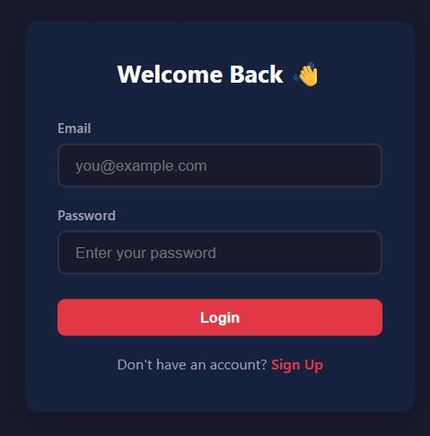

---

### 📝 Sign Up
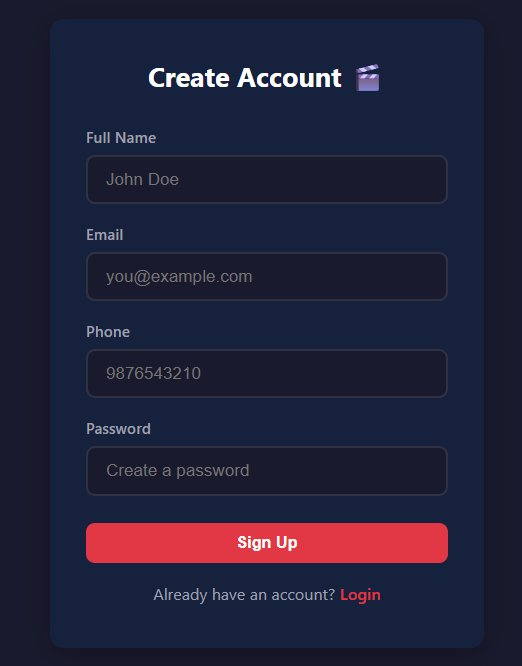

---

### 🏠 Home Page
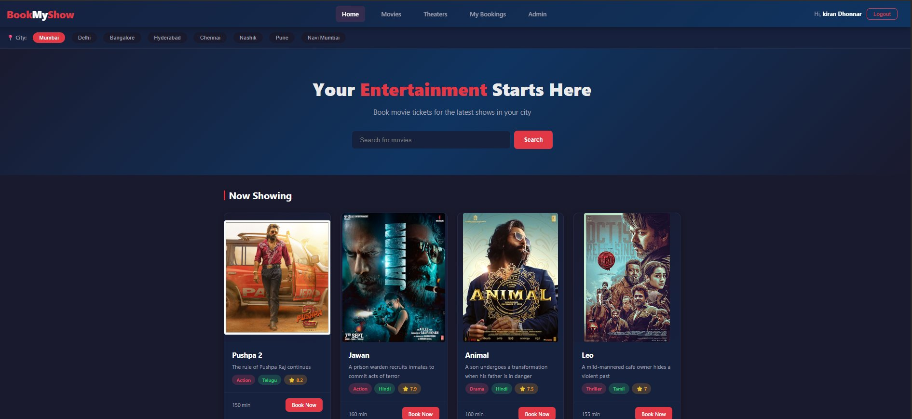

---

### 🎥 All Movies
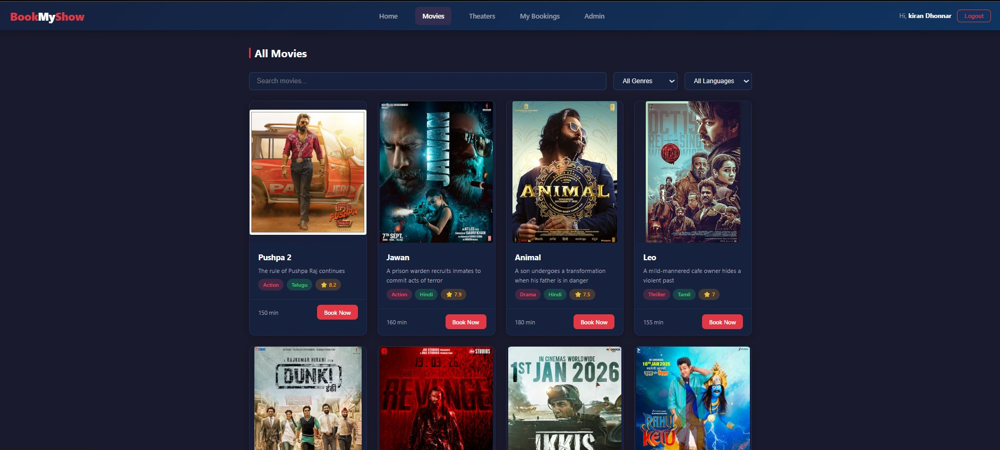

---

### 🪑 Seat Selection
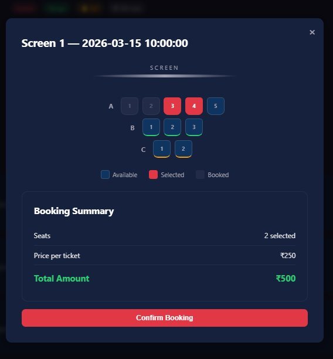

---

### 🏛️ Theaters
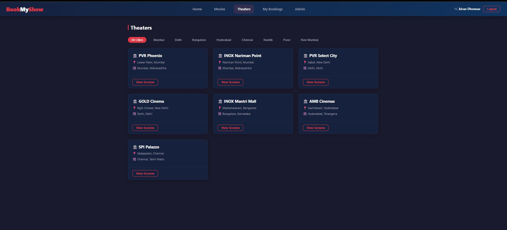

---

### 📋 My Bookings
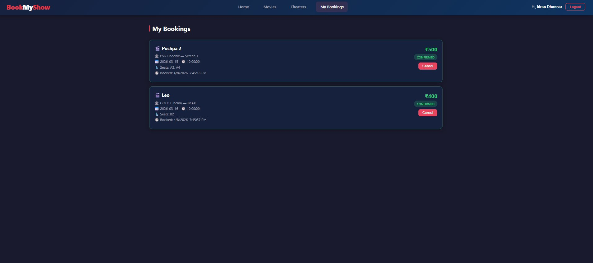

---

### ⚙️ Admin Panel — Cities
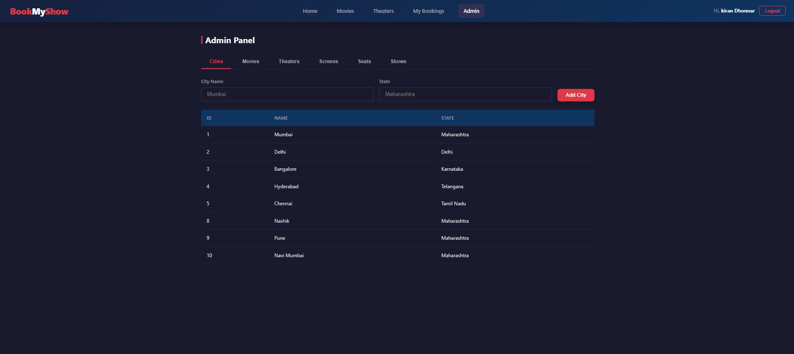

---

### ⚙️ Admin Panel — Movies
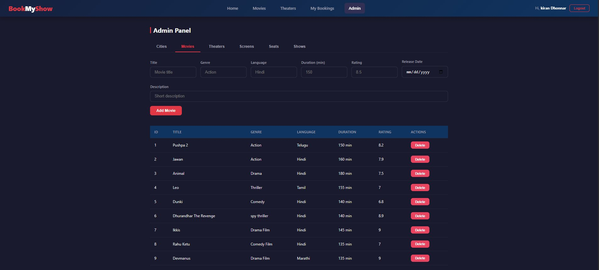

---

### ⚙️ Admin Panel — Theaters
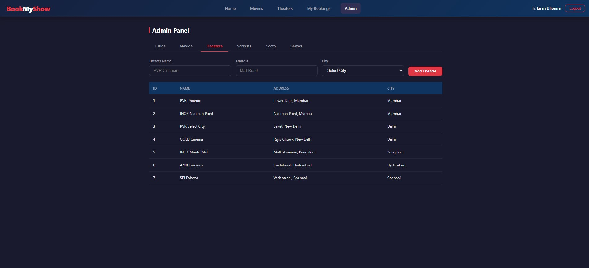

---

### ⚙️ Admin Panel — Screens
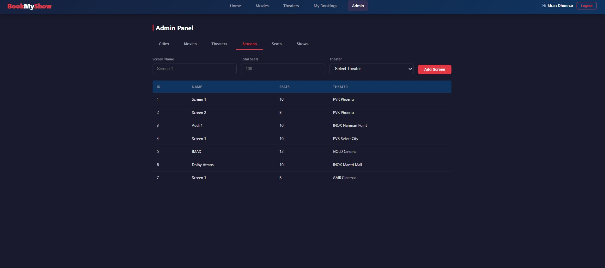

---

### ⚙️ Admin Panel — Shows
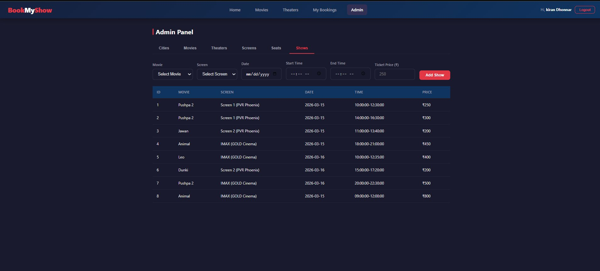

---

## 📁 Project Structure

```
bookmyshow/
├── src/
│   ├── main/
│   │   ├── java/com/bookmyshow/
│   │   │   ├── controller/          # REST Controllers
│   │   │   │   ├── AuthController.java
│   │   │   │   ├── MovieController.java
│   │   │   │   ├── TheaterController.java
│   │   │   │   ├── ShowController.java
│   │   │   │   ├── BookingController.java
│   │   │   │   ├── SeatController.java
│   │   │   │   └── AdminController.java
│   │   │   ├── model/               # JPA Entity Classes
│   │   │   │   ├── User.java
│   │   │   │   ├── City.java
│   │   │   │   ├── Movie.java
│   │   │   │   ├── Theater.java
│   │   │   │   ├── Screen.java
│   │   │   │   ├── Seat.java
│   │   │   │   ├── Show.java
│   │   │   │   └── Booking.java
│   │   │   ├── repository/          # Spring Data JPA Repositories
│   │   │   │   ├── UserRepository.java
│   │   │   │   ├── CityRepository.java
│   │   │   │   ├── MovieRepository.java
│   │   │   │   ├── TheaterRepository.java
│   │   │   │   ├── ScreenRepository.java
│   │   │   │   ├── SeatRepository.java
│   │   │   │   ├── ShowRepository.java
│   │   │   │   └── BookingRepository.java
│   │   │   ├── service/             # Business Logic Layer
│   │   │   │   ├── UserService.java
│   │   │   │   ├── MovieService.java
│   │   │   │   ├── TheaterService.java
│   │   │   │   ├── ShowService.java
│   │   │   │   ├── BookingService.java
│   │   │   │   └── SeatService.java
│   │   │   └── BookMyShowApplication.java
│   │   └── resources/
│   │       ├── static/              # Frontend Files
│   │       │   ├── index.html
│   │       │   ├── movies.html
│   │       │   ├── theaters.html
│   │       │   ├── bookings.html
│   │       │   ├── admin.html
│   │       │   ├── login.html
│   │       │   ├── register.html
│   │       │   ├── css/
│   │       │   │   └── style.css
│   │       │   └── js/
│   │       │       ├── app.js
│   │       │       ├── movies.js
│   │       │       ├── theaters.js
│   │       │       ├── booking.js
│   │       │       └── admin.js
│   │       └── application.properties
│   └── test/
│       └── java/com/bookmyshow/
├── screenshots/                     # README screenshots
├── pom.xml
└── README.md
```

---

## 🗄️ Database Schema

```
cities          → id, name, state
movies          → id, title, genre, language, duration, rating, description, release_date, poster_url
theaters        → id, name, address, city_id (FK → cities)
screens         → id, name, total_seats, theater_id (FK → theaters)
seats           → id, seat_number, row_label, screen_id (FK → screens)
shows           → id, movie_id, screen_id, show_date, start_time, end_time, ticket_price
bookings        → id, user_id, show_id, seats (JSON/relation), total_amount, status, booked_at
users           → id, full_name, email, phone, password
```

---

## ⚙️ Setup & Installation

### Prerequisites

- **Java 21** (LTS) — [Download here](https://adoptium.net/)
- Maven 3.9+
- MySQL 8.x
- Git

### 1. Clone the Repository

```bash
git clone https://github.com/your-username/bookmyshow.git
cd bookmyshow
```

### 2. Create the MySQL Database

```sql
CREATE DATABASE bookmyshow;
```

### 3. Configure `application.properties`

Edit `src/main/resources/application.properties`:

```properties
spring.datasource.url=jdbc:mysql://localhost:3306/bookmyshow
spring.datasource.username=your_mysql_username
spring.datasource.password=your_mysql_password
spring.datasource.driver-class-name=com.mysql.cj.jdbc.Driver

spring.jpa.hibernate.ddl-auto=update
spring.jpa.show-sql=true
spring.jpa.properties.hibernate.dialect=org.hibernate.dialect.MySQL8Dialect

server.port=8080
```

### 4. Build & Run

```bash
mvn clean install
mvn spring-boot:run
```

The application will start at: **http://localhost:8080**

---

## 📦 Maven Dependencies (`pom.xml`)

```xml
<properties>
    <java.version>21</java.version>
</properties>

<dependencies>
    <!-- Spring Boot Starter Web -->
    <dependency>
        <groupId>org.springframework.boot</groupId>
        <artifactId>spring-boot-starter-web</artifactId>
    </dependency>

    <!-- Spring Data JPA -->
    <dependency>
        <groupId>org.springframework.boot</groupId>
        <artifactId>spring-boot-starter-data-jpa</artifactId>
    </dependency>

    <!-- MySQL Connector -->
    <dependency>
        <groupId>com.mysql</groupId>
        <artifactId>mysql-connector-j</artifactId>
        <scope>runtime</scope>
    </dependency>

    <!-- Lombok -->
    <dependency>
        <groupId>org.projectlombok</groupId>
        <artifactId>lombok</artifactId>
        <optional>true</optional>
    </dependency>

    <!-- Spring Boot Test -->
    <dependency>
        <groupId>org.springframework.boot</groupId>
        <artifactId>spring-boot-starter-test</artifactId>
        <scope>test</scope>
    </dependency>
</dependencies>
```

---

## 🔌 REST API Endpoints

### Auth
| Method | Endpoint | Description |
|---|---|---|
| POST | `/api/auth/register` | Register new user |
| POST | `/api/auth/login` | User login |
| POST | `/api/auth/logout` | Logout |

### Movies
| Method | Endpoint | Description |
|---|---|---|
| GET | `/api/movies` | Get all movies |
| GET | `/api/movies/{id}` | Get movie by ID |
| POST | `/api/movies` | Add movie (Admin) |
| DELETE | `/api/movies/{id}` | Delete movie (Admin) |

### Shows
| Method | Endpoint | Description |
|---|---|---|
| GET | `/api/shows/movie/{movieId}` | Get shows for a movie |
| GET | `/api/shows/{showId}/seats` | Get seat availability for a show |
| POST | `/api/shows` | Add show (Admin) |

### Bookings
| Method | Endpoint | Description |
|---|---|---|
| POST | `/api/bookings` | Confirm a booking |
| GET | `/api/bookings/user/{userId}` | Get user's bookings |
| PUT | `/api/bookings/{id}/cancel` | Cancel a booking |

### Admin
| Method | Endpoint | Description |
|---|---|---|
| GET/POST | `/api/admin/cities` | Manage cities |
| GET/POST | `/api/admin/theaters` | Manage theaters |
| GET/POST | `/api/admin/screens` | Manage screens |
| GET/POST | `/api/admin/seats` | Manage seats |

---

## 🖥️ Application Pages

| Page | URL | Description |
|---|---|---|
| Home | `/` | Landing page with Now Showing movies |
| Movies | `/movies.html` | All movies with search and filter |
| Movie Detail | `/movie.html?id={id}` | Movie info + available shows |
| Theaters | `/theaters.html` | Theater listing filtered by city |
| My Bookings | `/bookings.html` | Current user's booking history |
| Admin Panel | `/admin.html` | Full CRUD admin dashboard |
| Login | `/login.html` | User login page |
| Register | `/register.html` | New user registration |

---

## 👤 User Roles

| Role | Capabilities |
|---|---|
| **User** | Browse movies, book tickets, view/cancel own bookings |
| **Admin** | All user capabilities + manage cities, movies, theaters, screens, seats, and shows |

---

## 🧪 Sample Data

The application ships with pre-loaded data including:

**Cities:** Mumbai, Delhi, Bangalore, Hyderabad, Chennai, Nashik, Pune, Navi Mumbai

**Movies:** Pushpa 2, Jawan, Animal, Leo, Dunki, Dhurandhar The Revenge, Ikkis, Rahu Ketu, Devmanus

**Theaters:** PVR Phoenix, INOX Nariman Point, PVR Select City, GOLD Cinema, INOX Mantri Mall, AMB Cinemas, SPI Palazzo

---

## 🙏 Acknowledgements

- Inspired by [BookMyShow](https://www.bookmyshow.com)
- Movie poster images sourced for demo purposes only
- Built as a full-stack learning project using the Spring Boot ecosystem

---

